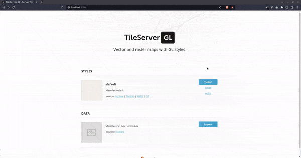

<!-- @format -->

# malaysia-tileserver



Contains an open-source map server, [tileserver-gl](http://tileserver.org/) for serving vector & raster tiles & the Malaysia-Singapore-Brunei map. The map is generated from [openmaptiles](https://github.com/openmaptiles/openmaptiles).

## You can find:

| Resources                           | Type   | Format   | Applicable Style     | Description                                    |
| ----------------------------------- | ------ | -------- | -------------------- | ---------------------------------------------- |
| Map of Malaysia, Singapore & Brunei | Vector | .mbtiles | light, dark, terrain | Macro view up to street/residential level view |
| 10m Contour lines                   | Vector | .mbtiles | terrain              | Contour lines with a vertical distance of 10m  |
| 20m Contour lines                   | Vector | .mbtiles | terrain              | Contour lines with a vertical distance of 20m  |
| 40m Contour lines                   | Vector | .mbtiles | terrain              | Contour lines with a vertical distance of 40m  |
| 80m Contour lines                   | Vector | .mbtiles | terrain              | Contour lines with a vertical distance of 10m  |
| High resolution hillshade           | Raster | .mbtiles | terrain              | Hillshade based on elevation                   |

Also included is [maputnik/editor](https://github.com/maputnik/editor), an open source visual editor for the 'Mapbox Style Specification'. This is optional and

## Prerequisites

1. Install the following:

-   Docker
-   Docker Compose

2. Copy the `docker-compose.example` to `docker-compose.yml` and add a `/data` folder (if missing)

```bash
cp docker-compose.example docker-compose.yml
mkdir data
```

3. Download the map data (.zip) and extract it inside `/data`

-   [\*Malaysia-Singapore-Brunei Map Pack [1.4GB] (Google Drive)](https://drive.google.com/file/d/1f9MllVDNz9BSBuIFCkST55tq14F2CDMP/view?usp=share_link)

\*_10m contour line not included yet_

## Usage

To run the server:

```bash
docker-compose up
```

To stop the server:

```bash
docker-compose down
```

To checkout the map tiles and preview the styles & layers, open up http://localhost:8080 in your browser.

You can use this mapserver to provide for your client-side apps. Works well with client-side mapping library like [leaflet.js](https://leafletjs.com/) or [mapbox](https://www.mapbox.com/)

Read the documentation for the available endpoints here: [TileServer GL Docs](https://tileserver.readthedocs.io/en/latest/endpoints.html)

## TODO

-   ~~Add more map styles (dark mode, satellite etc)~~
-   Create a Docker image of the tileserver
-   Add API key feature for securing endpoints
